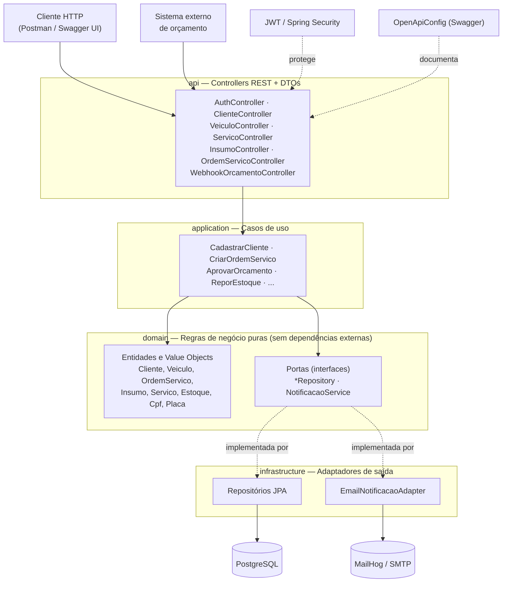
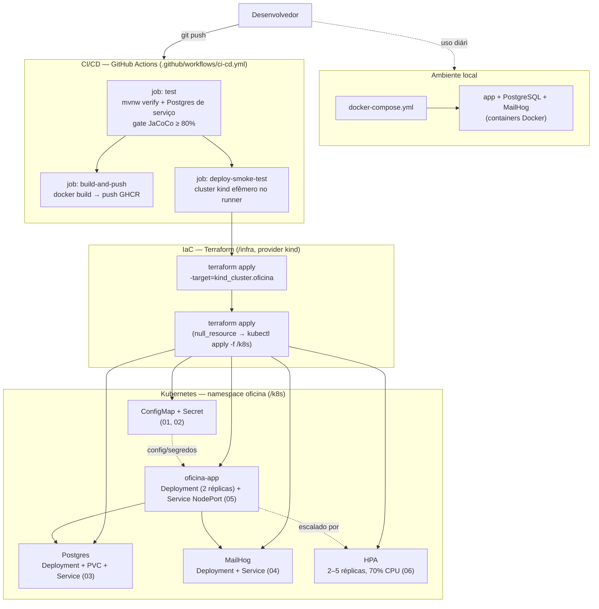

# 🚗 Oficina Mecânica — Sistema de Gestão

> Back-end do sistema de gestão de uma oficina mecânica, desenvolvido como Tech Challenge da Fase 2 do programa **SOAT — Software Architecture** da FIAP (evolução da Fase 1: Clean Architecture, containerização, Kubernetes, Terraform e CI/CD).

---

## 📋 Sobre o Projeto

Sistema desenvolvido com foco em **Domain-Driven Design (DDD)**, aplicando boas práticas de qualidade de software e segurança. O sistema permite o gerenciamento completo do ciclo de vida de uma Ordem de Serviço — desde o atendimento inicial até a entrega do veículo ao cliente.

### Desafio

Uma oficina mecânica de médio porte precisava substituir seus processos manuais (anotações e planilhas) por um sistema integrado que permitisse:

- Gerenciar ordens de serviço com controle de status em tempo real
- Controlar estoque de peças e insumos
- Gerar orçamentos automaticamente
- Autenticar e proteger APIs administrativas

---

## 🛠 Stack Tecnológica

| Tecnologia | Versão | Finalidade |
|---|---|---|
| Java | 21 | Linguagem principal |
| Spring Boot | 4.0.5 | Framework back-end |
| PostgreSQL | 16 | Banco de dados |
| Docker | - | Containerização |
| Swagger/OpenAPI | 2.8.6 | Documentação da API |
| JWT (jjwt) | 0.12.5 | Autenticação |
| JaCoCo | 0.8.11 | Cobertura de testes |
| Trivy | 0.70 | Análise de vulnerabilidades |

### Justificativa do banco de dados

O **PostgreSQL** foi escolhido por ser um banco relacional robusto, open-source e amplamente utilizado no mercado. O domínio da oficina possui relacionamentos bem definidos entre entidades (Cliente → Veículo → OrdemDeServico → ItemOS), o que favorece o modelo relacional. Além disso, possui excelente suporte ao tipo `UUID`, utilizado como identificador em todas as entidades do domínio.

---

## 🏗 Arquitetura

O projeto segue **arquitetura em camadas** (Clean Architecture / Hexagonal) com princípios de **DDD (Domain-Driven Design)**. A regra de dependência aponta sempre para dentro: `api` depende de `application`, que depende de `domain`; `infrastructure` implementa as interfaces (portas) definidas no `domain`, e nunca o contrário.



```
src/main/java/br/com/oficina/
├── domain/              # Regras de negócio puras — sem dependências externas
│   ├── cliente/         # Entidade Cliente + Value Object Cpf
│   ├── veiculo/         # Entidade Veiculo + Value Object Placa
│   ├── ordemServico/    # Aggregate Root OrdemServico + ItemOS + Orcamento
│   ├── insumo/          # Entidade Insumo
│   ├── estoque/         # Entidade Estoque
│   ├── servico/         # Entidade Servico
│   ├── notificacao/     # Porta NotificacaoService
│   └── exception/       # Exceções de domínio
│
├── application/         # Casos de uso — orquestra o domínio
│   ├── cliente/
│   ├── veiculo/
│   ├── ordemServico/
│   ├── insumo/
│   └── servico/
│
├── infrastructure/      # Detalhes técnicos — adaptadores de saída
│   ├── persistence/     # Repositórios JPA (implementam as portas do domain)
│   ├── security/        # JWT, Spring Security
│   ├── notificacao/     # EmailNotificacaoAdapter (implementa NotificacaoService)
│   └── openapi/         # Configuração do Swagger (SecurityScheme JWT)
│
└── api/                 # Controllers REST + DTOs
    ├── auth/
    ├── cliente/
    ├── veiculo/
    ├── ordemServico/
    ├── insumo/
    └── servico/
```

### Bounded Contexts (DDD)

| Contexto | Responsabilidade |
|---|---|
| **Atendimento** | Identificação/cadastro de cliente e veículo |
| **Diagnóstico** | Diagnóstico, verificação de estoque e orçamento |
| **Execução** | Aprovação do orçamento e execução do serviço |
| **Entrega** | Finalização, notificação e entrega do veículo |

### Infraestrutura provisionada e fluxo de deploy



O mesmo Terraform de `/infra` roda tanto localmente (seção [Deploy em Kubernetes](#☸️-deploy-em-kubernetes) abaixo) quanto dentro do job `deploy-smoke-test` do CI/CD: cria o cluster kind, carrega a imagem e aplica os manifestos de `/k8s`; a diferença é que no CI o cluster é destruído ao final (`terraform destroy`), servindo como teste de fumaça do provisionamento a cada push.

---

## 🚀 Como executar

### Pré-requisitos

- [Docker Desktop](https://www.docker.com/products/docker-desktop) instalado e em execução
- Git

### Passo a passo

**1. Clone o repositório**

```bash
git clone https://github.com/seu-usuario/fiap-TC1-oficina.git
cd fiap-TC1-oficina
```

**2. Configure as variáveis de ambiente**

Copie o arquivo de exemplo e ajuste os valores conforme necessário:

```bash
cp .env.example .env
```

**3. Suba o ambiente completo**

```bash
docker-compose up --build
```

Este comando irá:
- Baixar e iniciar o container do **PostgreSQL 16**
- Baixar e iniciar o container do **MailHog** (SMTP de teste, UI em http://localhost:8025)
- Compilar e iniciar o container da **aplicação Spring Boot**
- Criar automaticamente todas as tabelas via Hibernate

**4. Acesse a aplicação**

| Recurso | URL                                         |
|---|---------------------------------------------|
| API | http://localhost:8080                       |
| Swagger UI | http://localhost:8080/swagger-ui/index.html |
| API Docs (JSON) | http://localhost:8080/v3/api-docs           |
| MailHog (e-mails de teste) | http://localhost:8025          |

---

## ☸️ Deploy em Kubernetes

Os manifestos ficam em `/k8s`, com prefixo numérico para garantir a ordem de aplicação (namespace → config → segredos → banco → mailhog → app → HPA):

```
k8s/
├── 00-namespace.yaml    # namespace "oficina"
├── 01-configmap.yaml    # config não sensível (URL do banco, host/porta do SMTP, etc.)
├── 02-secret.yaml       # credenciais do banco e chave JWT (valores placeholder — troque antes de usar fora do seu ambiente local)
├── 03-postgres.yaml     # PersistentVolumeClaim + Deployment + Service do Postgres
├── 04-mailhog.yaml      # Deployment + Service do MailHog
├── 05-app.yaml          # Deployment + Service da aplicação
└── 06-hpa.yaml          # HorizontalPodAutoscaler da aplicação (2 a 5 réplicas, 70% CPU)
```

### Pré-requisitos

- `docker`, `kind`, `kubectl` e `terraform` (>= 1.5) instalados.
- A imagem `oficina-app:latest` já construída (`docker build -t oficina-app:latest .` na raiz do projeto).
- O **metrics-server** instalado no cluster — sem ele, o HPA não consegue ler métricas de CPU e não escala (kind não vem com ele por padrão).

### Aplicar

O cluster **kind** e os manifestos de `/k8s` são provisionados pelo Terraform em `/infra`:

```bash
docker build -t oficina-app:latest .
cd infra
terraform init
terraform apply -target=kind_cluster.oficina   # só o cluster
kind load docker-image oficina-app:latest --name oficina
terraform apply                                # aplica os manifestos de /k8s
```

O primeiro `apply` cria só o cluster kind (com as portas 8080 e 8025 já mapeadas para o host), para dar tempo de carregar a imagem antes de qualquer pod ser agendado — se os manifestos forem aplicados antes da imagem existir no cluster, os pods da app entram em `ImagePullBackOff`. O segundo `apply` aplica os manifestos de `/k8s`; rodar de novo reaplica caso algum arquivo em `/k8s` mude.

Para destruir o cluster: `terraform destroy` dentro de `/infra`.

### Acessar

Como a app e o MailHog usam `Service` do tipo `NodePort`, com o mapeamento de portas feito pelo Terraform a API fica em `http://localhost:8080` e a UI do MailHog em `http://localhost:8025`, exatamente como no `docker-compose`. Sem esse mapeamento, use `kubectl port-forward service/oficina-app 8080:8080 -n oficina`.

---

## 🔐 Autenticação

As APIs administrativas são protegidas por **JWT**. O usuário e a senha do admin são configurados via as variáveis de ambiente `ADMIN_USERNAME`/`ADMIN_PASSWORD` (veja `.env.example`) — não há credencial fixa no código. Para acessar os endpoints protegidos:

**1. Faça login**

```http
POST /auth/login
Content-Type: application/json

{
  "usuario": "<ADMIN_USERNAME>",
  "senha": "<ADMIN_PASSWORD>"
}
```

**2. Use o token retornado no header das requisições**

```http
Authorization: Bearer <seu_token_aqui>
```

> ⚠️ O token expira em 24 horas (configurável via `JWT_EXPIRATION`).

**Testando pelo Swagger UI**: após o login, clique em **Authorize** (canto superior direito de `/swagger-ui/index.html`), cole o token e todos os endpoints protegidos ficam testáveis via "Try it out". Login (`/auth/login`) e o webhook de orçamento são públicos e não exigem esse passo.

---

## 📡 Endpoints Principais

### Autenticação
| Método | Endpoint | Descrição | Auth |
|---|---|---|---|
| POST | `/auth/login` | Obter token JWT | ❌ |

### Clientes
| Método | Endpoint | Descrição | Auth |
|---|---|---|---|
| POST | `/clientes` | Cadastrar cliente | ✅ |
| GET | `/clientes` | Listar clientes | ✅ |
| GET | `/clientes/{id}` | Buscar por ID | ✅ |
| GET | `/clientes/cpf/{cpf}` | Buscar por CPF/CNPJ | ✅ |
| PUT | `/clientes/{id}` | Atualizar cliente | ✅ |
| DELETE | `/clientes/{id}` | Excluir cliente | ✅ |

### Veículos
| Método | Endpoint | Descrição | Auth |
|---|---|---|---|
| POST | `/veiculos` | Cadastrar veículo | ✅ |
| GET | `/veiculos` | Listar veículos | ✅ |
| GET | `/veiculos/{id}` | Buscar por ID | ✅ |
| GET | `/veiculos/placa/{placa}` | Buscar por placa | ✅ |
| GET | `/veiculos/proprietario/{cpf}` | Listar por proprietário | ✅ |
| PUT | `/veiculos/{id}` | Atualizar veículo | ✅ |
| DELETE | `/veiculos/{id}` | Excluir veículo | ✅ |

### Ordens de Serviço
| Método | Endpoint | Descrição | Auth |
|---|---|---|---|
| POST | `/ordens-servico` | Criar OS | ✅ |
| GET | `/ordens-servico` | Listar OSs | ✅ |
| GET | `/ordens-servico/{id}` | Buscar OS por ID | ✅ |
| PATCH | `/ordens-servico/{id}/diagnostico/iniciar` | Iniciar diagnóstico | ✅ |
| PATCH | `/ordens-servico/{id}/diagnostico/concluir` | Concluir diagnóstico | ✅ |
| PATCH | `/ordens-servico/{id}/orcamento/aprovar` | Aprovar orçamento | ✅ |
| PATCH | `/ordens-servico/{id}/orcamento/rejeitar` | Rejeitar orçamento | ✅ |
| PATCH | `/ordens-servico/{id}/servico/concluir` | Concluir serviço | ✅ |
| PATCH | `/ordens-servico/{id}/entrega` | Registrar entrega | ✅ |
| POST | `/ordens-servico/{id}/itens` | Adicionar item à OS | ✅ |

### Webhook
| Método | Endpoint | Descrição | Auth |
|---|---|---|---|
| POST | `/webhooks/ordens-servico/{id}/orcamento` | Receber decisão de orçamento de sistema externo | ❌ |

### Insumos e Estoque
| Método | Endpoint | Descrição | Auth |
|---|---|---|---|
| POST | `/insumos` | Cadastrar insumo | ✅ |
| GET | `/insumos` | Listar insumos | ✅ |
| GET | `/insumos/{id}` | Buscar por ID | ✅ |
| PUT | `/insumos/{id}` | Atualizar insumo | ✅ |
| DELETE | `/insumos/{id}` | Excluir insumo | ✅ |
| PATCH | `/insumos/{id}/estoque/repor` | Repor estoque | ✅ |
| PATCH | `/insumos/{id}/estoque/reduzir` | Reduzir estoque | ✅ |

### Serviços
| Método | Endpoint | Descrição | Auth |
|---|---|---|---|
| POST | `/servicos` | Cadastrar serviço | ✅ |
| GET | `/servicos` | Listar serviços | ✅ |
| GET | `/servicos/{id}` | Buscar por ID | ✅ |
| PUT | `/servicos/{id}` | Atualizar serviço | ✅ |
| DELETE | `/servicos/{id}` | Excluir serviço | ✅ |

---

## 🔄 Fluxo da Ordem de Serviço

```
RECEBIDA
   ↓ iniciarDiagnostico()
EM_DIAGNOSTICO
   ↓ finalizarDiagnostico()
AGUARDANDO_APROVACAO
   ↓ aprovarOrcamento()          ↓ rejeitarOrcamento()
EM_EXECUCAO                    FINALIZADA (encerrada)
   ↓ finalizarServico()
FINALIZADA
   ↓ registrarEntrega()
ENTREGUE
```

---

## 🧪 Testes

O projeto possui **115 testes automatizados** (114 testes unitários + 1 teste de contexto Spring) com **90% de cobertura de linha** nos domínios críticos (`domain` + `application`), superando com folga o mínimo exigido de 80%.

| Métrica | Resultado |
|---|---|
| Total de testes | 115 |
| Testes passando | 115 ✅ |
| Cobertura de linha (domain + application) | **90%** |
| Meta exigida | 80% |
| Ferramenta | JaCoCo 0.8.11 |

### Executar testes

```bash
./mvnw test
```

### Gerar relatório de cobertura (JaCoCo)

```bash
./mvnw test
# Relatório gerado em: target/site/jacoco/index.html
```

> O JaCoCo está configurado para medir apenas os pacotes `domain` e `application`, que contêm as regras de negócio críticas do sistema. Os pacotes `api` e `infrastructure` são excluídos da medição por serem camadas de infraestrutura sem lógica de negócio.

### Estrutura dos testes

```
src/test/java/br/com/oficina/
├── domain/                     # 9 arquivos — 42 testes — regras de negócio puras
│   ├── OrdemServicoTest.java      # 9 testes — transições de status
│   ├── CpfTest.java               # 6 testes — validação CPF/CNPJ
│   ├── PlacaTest.java             # 5 testes — validação de placa
│   ├── EstoqueTest.java           # 4 testes — controle de estoque
│   ├── ClienteTest.java           # 5 testes — entidade cliente
│   ├── VeiculoTest.java           # 4 testes — entidade veículo
│   ├── InsumoTest.java            # 3 testes — entidade insumo
│   ├── OrcamentoTest.java         # 3 testes — entidade orçamento
│   └── ItemOSTest.java            # 3 testes — item de OS
├── application/                # 32 arquivos — 70 testes — casos de uso
│   ├── cliente/                    # 5 arquivos — 11 testes
│   ├── veiculo/                    # 4 arquivos — 9 testes
│   ├── servico/                    # 5 arquivos — 10 testes
│   ├── insumo/                     # 7 arquivos — 14 testes (inclui repor/reduzir estoque)
│   └── ordemServico/               # 11 arquivos — 26 testes (fluxo completo da OS + notificação)
├── infrastructure/notificacao/
│   └── EmailNotificacaoAdapterTest.java   # 2 testes — envio de e-mail e falha de SMTP
└── OficinaApplicationTests.java   # 1 teste — carregamento do contexto Spring
```

---

## 🔒 Segurança

### Medidas implementadas

- **Autenticação JWT** em todos os endpoints administrativos
- **Validação de CPF/CNPJ** com algoritmo de dígitos verificadores
- **Validação de placa** com suporte ao padrão Mercosul e antigo
- **Variáveis de ambiente** para todas as credenciais sensíveis
- **CSRF desabilitado** para APIs stateless (padrão REST)
- **Sessões stateless** via `SessionCreationPolicy.STATELESS`

### Análise de vulnerabilidades

Foi realizado scan de segurança utilizando **Trivy v0.70** nas dependências do projeto. O relatório completo está disponível em [`trivy-report.txt`](./trivy-report.txt) e a análise detalhada em [`relatorio_vulnerabilidades.pdf`](./relatorio_vulnerabilidades.pdf).

**Resumo:**
- 0 vulnerabilidades CRITICAL
- 3 vulnerabilidades HIGH (2 corrigidas)
- 1 vulnerabilidade MEDIUM (aguardando fix upstream)

---

## 📚 Documentação DDD

A documentação completa do Event Storming e modelagem DDD está disponível no Miro:

🔗 **[Acesse a documentação no Miro](https://miro.com/app/board/uXjVGliXLok=/?share_link_id=13217059395)**

Inclui:
- Event Storming completo com todos os fluxos
- Bounded Contexts definidos
- Linguagem Ubíqua aplicada
- Agregados e entidades mapeados

---

## 📁 Estrutura do Repositório

```
fiap-TC1-oficina/
├── src/
│   ├── main/java/br/com/oficina/
│   └── test/java/br/com/oficina/
├── k8s/                        # Manifestos Kubernetes (Deployments, Services, ConfigMap, Secret, HPA)
├── infra/                      # Terraform: provisiona o cluster kind e aplica os manifestos de /k8s
├── Dockerfile
├── docker-compose.yml
├── .dockerignore
├── .env.example
├── pom.xml
├── trivy-report.txt
├── relatorio_vulnerabilidades.pdf
├── application.properties.example
└── README.md
```

---

## 👨‍💻 Desenvolvedor

| Nome | RM | Discord |
|---|---|---|
| Matheus Victor Moreira Mendes | rm373132 | m.victor99 |

---

## 📄 Licença

Este projeto foi desenvolvido para fins acadêmicos como parte do programa **SOAT — Software Architecture** da **FIAP PosTech**.
