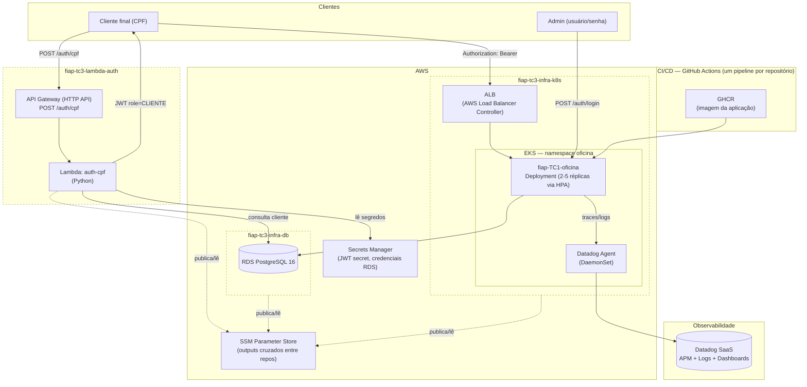

# Diagrama de Componentes — Visão Fase 3

Cobre nuvem, APIs, banco e monitoramento, com a fronteira de cada um dos 4 repositórios marcada.

## Os 4 repositórios e o que cada um provisiona/executa

| # | Repositório | Conteúdo |
|---|---|---|
| 1 | [`fiap-tc3-lambda-auth`](https://github.com/MatVicDev/fiap-tc3-lambda-auth) | Function Serverless de autenticação por CPF + API Gateway (Terraform) |
| 2 | [`fiap-tc3-infra-k8s`](https://github.com/MatVicDev/fiap-tc3-infra-k8s) | VPC, EKS, node group com autoscaling, AWS Load Balancer Controller, Datadog Agent (Terraform) |
| 3 | [`fiap-tc3-infra-db`](https://github.com/MatVicDev/fiap-tc3-infra-db) | RDS PostgreSQL gerenciado (Terraform) |
| 4 | [`fiap-TC1-oficina`](https://github.com/MatVicDev/fiap-TC1-oficina) | Aplicação principal (Spring Boot) + manifests Kubernetes + Dockerfile |

Ligação entre repositórios independentes: SSM Parameter Store, não Terraform remote state (ver seção "Rede" do README de `fiap-tc3-infra-db` e `fiap-tc3-lambda-auth`) — cada repositório tem pipeline e ciclo de vida próprios.
