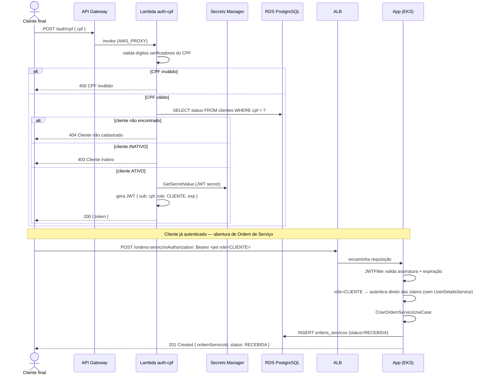

# Diagrama de Sequência — Autenticação por CPF + Abertura de Ordem de Serviço

## Pontos de atenção documentados

- A autenticação (via API Gateway) e a operação de negócio (via ALB) são **dois endpoints/domínios distintos** — ver [ADR-003](./ADR-003-gateway-somente-para-lambda.md). O cliente troca de host entre a etapa de login e as etapas seguintes.
- O `JWTFilter` da aplicação não distingue "de onde" veio a chamada, só a assinatura e o claim `role` do token — por isso o mesmo filtro aceita tokens do login admin (`role=ADMIN`, verificados contra o `UserDetailsService`) e da Lambda (`role=CLIENTE`, autenticado direto das claims). Detalhes em [RFC-002](./RFC-002-estrategia-autenticacao-cpf.md).
- Todo log de ambas as etapas carrega um `correlationId` (gerado pela Lambda ou pelo `CorrelationIdFilter` da aplicação, propagado via header `X-Correlation-Id`), permitindo juntar num único dashboard do Datadog os logs de uma mesma sessão do cliente mesmo atravessando dois serviços diferentes.
